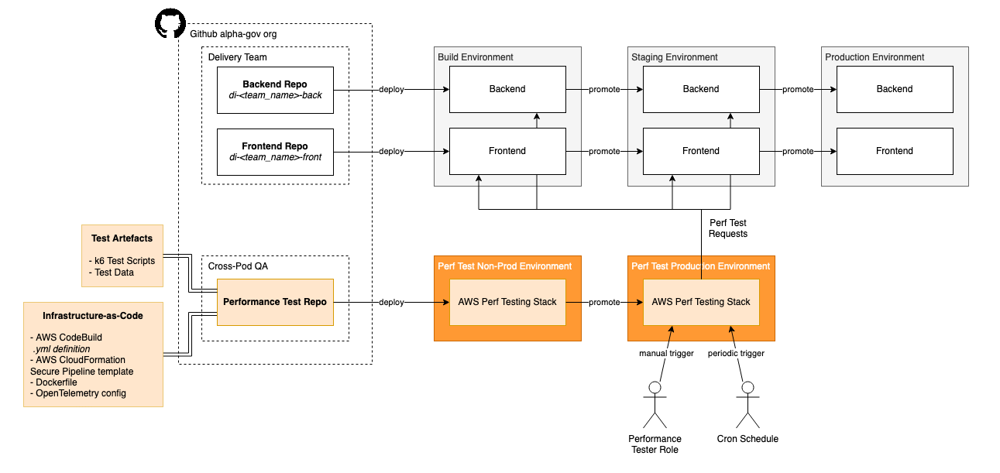

[](https://github.com/govuk-one-login/performance-testing/actions/workflows/publish.yaml)

---

# Performance Testing Framework

This repository contains the performance test framework for testing Digital Identity happy path user journeys.

## Getting Started

### Required Installations

- [pre-commit](https://pre-commit.com/) for running pre-commit hooks locally
  ```console
  % brew install pre-commit && pre-commit install && pre-commit install -tprepare-commit-msg -tcommit-msg
  ```
- [k6](https://k6.io/docs/get-started/installation/) for testing and executing scripts locally
  ```console
  % brew install k6
  ```

### Optional Installations

- [AWS CLI](https://docs.aws.amazon.com/cli/latest/userguide/getting-started-install.html) for command line access to AWS resources
- [AWS SAM CLI](https://docs.aws.amazon.com/serverless-application-model/latest/developerguide/install-sam-cli.html) only needed for platform engineers managing the serverless resources and pipelines
  ```console
  % brew install aws/tap/aws-sam-cli
  ```
- [GDS CLI](https://github.com/alphagov/gds-cli) for command line access to internal AWS accounts and resources
  ```console
  % brew install alphagov/gds/gds-cli
  ```
- [Docker](https://docker.com) for building or testing the [Dockerfile](deploy/Dockerfile) locally

## Contributing

If you would like to create a new test script or make changes to any of the existing test scripts, first read through the information in [`deploy/scripts/README.md`](deploy/scripts/README.md). Create a new `.ts` file in the appropriate team folder within the `deploy/scripts` directory or change an existing one.

Raise pull requests for any changes, including the JIRA ticket number in the description. Pull requests must pass pre-commit hooks, linting and unit test checks before merging to main.

## Technology Stack

The infrastructure is defined as infrastructure-as-code in the form of a AWS CloudFormation [template](deploy/template.yaml). This defines the performance test application stack which consists of a AWS CodeBuild pipeline which orchestrates the performance tests.

The CodeBuild agent uses a Docker image, which is defined in the [Dockerfile](deploy/Dockerfile). The image contains:
- [k6](https://k6.io) - which is used as the load injector application
- [OpenTelemetry Collector](https://github.com/open-telemetry/opentelemetry-collector-contrib) - which uses the configuration [template](deploy/otel-config-template.yaml) to send [statsd](https://k6.io/docs/results-output/real-time/statsd/) metrics from k6 and host metrics from the CodeBuild agent to [Dynatrace](https://www.dynatrace.com/)
- Test data and scripts - Scripts are written in [TypeScript](https://www.typescriptlang.org/) and transpiled into JavaScript by [esbuild](https://esbuild.github.io/)



The performance test application is initially deployed to the `di-performance-test-non-prod` AWS account and then promoted to the `di-performance-test-prod` account. From the Production account, performance tests can be run against any given Build or Staging environment.