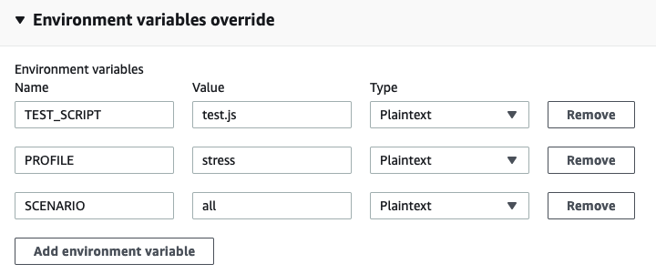

# Performance Test Scripts

This folder (`deploy/scripts`) contains the configuration, test scripts and test data for performance tests.

Test scripts are written in TypeScript, and transpiled into JavaScript via esbuild to run in k6. For deploying in environments these scripts are bundled into the Docker image which is used as the CodeBuild agent; when testing locally these can just be run directly from `deploy/scripts/dist`.

## Prerequisites

- [k6](https://k6.io/docs/getting-started/installation)
- [NodeJS](https://nodejs.org/en/download/)

## Local Installation
Clone the repository and navigate to this folder `deploy/scripts`. Then to install the dependencies in [`package.json`](package.json) run

```console
% npm install
```

## Local Testing
Test scripts are written in the `src` folder. Test script files must match the path ( `src/*.ts`) specified in the [build.js](build.js#L7) file. Static data files are kept in the `src/data`, they are copied to `dist/data` by esbuild as defined [here](build.js#L18-L25).

To run a TypeScript test locally, navigate to the `deploy/scripts` folder and run the following

```console
% npm start
```
This command will generate the JavaScript files in the `dist` folder. These can then be run with k6 in the normal way using a command such as

```console
% k6 run dist/test.js
```

## Unit Testing
Unit tests to validate the TypeScript utility files are contained in the [`src/unit-tests.js`](src/unit-tests.ts) file. They can be run to validate the utilities are working as intended by running

```console
% npm test
```

This unit test also runs when raising pull requests as a [github action](../../.github/workflows/push.yml). If adding an additional utility in the `src/utils` folder, add another `group` to the test script with `checks` to validate the behaviour.

## Running Performance Tests
1. Login to [`gds-users`](https://gds-users.signin.aws.amazon.com/console) AWS account

2. Switch to the relevant Performance Tester role.

    |Account|AWS ID|Role|Link|
    |:-:|:-:|:-:|:-:|
    |Build|`372033887444`|`performance-build-PerformanceTester`|[Switch role](https://signin.aws.amazon.com/switchrole?roleName=performance-build-PerformanceTester&account=372033887444)|
    |Staging|`223594937353`|`performance-staging-PerformanceTester`|[Switch role](https://signin.aws.amazon.com/switchrole?roleName=performance-staging-PerformanceTester&account=223594937353)|

3. Go to the CodeBuild project and click 'Start build with overrides':

    

    - [Build link](https://eu-west-2.console.aws.amazon.com/codesuite/codebuild/372033887444/projects/LoadTest-performance-build/builds/start?region=eu-west-2)
    - [Staging link](https://eu-west-2.console.aws.amazon.com/codesuite/codebuild/223594937353/projects/LoadTest-performance-build/builds/start?region=eu-west-2)

4. Update environment variables in the 'Environment variables override' section. All environment variables are available in test scripts in the `__ENV` variable (see [k6 docs](https://k6.io/docs/using-k6/environment-variables/))

    

    |Environment Variable|Example Values|Description|
    |-|-|-|
    |`TEST_SCRIPT`|`devplatform-test.js`</br>`test-data.js`</br>`test.js`<sup> [_default_]</sup></br>`unit-tests.js`|Relative path of test script to use, including `.js` extension|
    |`PROFILE`|`smoke`<sup> [_default_]</sup></br>`stress`</br>`load`|Used to select a named load profile described in the test script. Values should match the keys of a [`ProfileList`](src/utils/config/load-profiles.ts#L4) object|
    |`SCENARIOS`|`all`<sup> [_default_]</sup></br>`sign_in`</br>`create_account,sign_in`|Comma seperated list of scenarios to enable. Blank strings or `'all'` will default to enabling all scenarios in the selected load profile. Implementation in [`getScenarios`](src/utils/config/load-profiles.ts#L27-L36) function|

5. Click 'Start Build'

